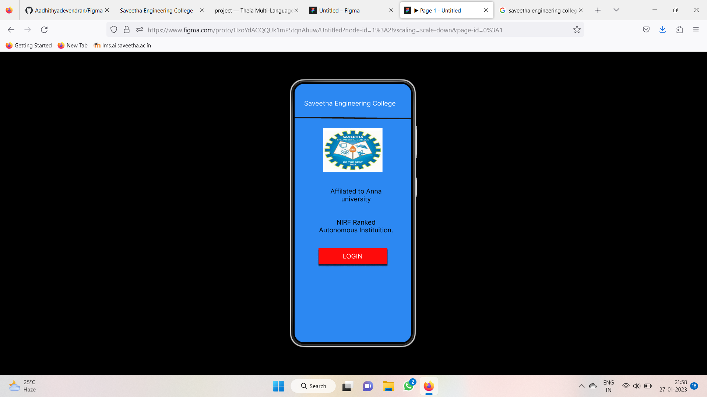
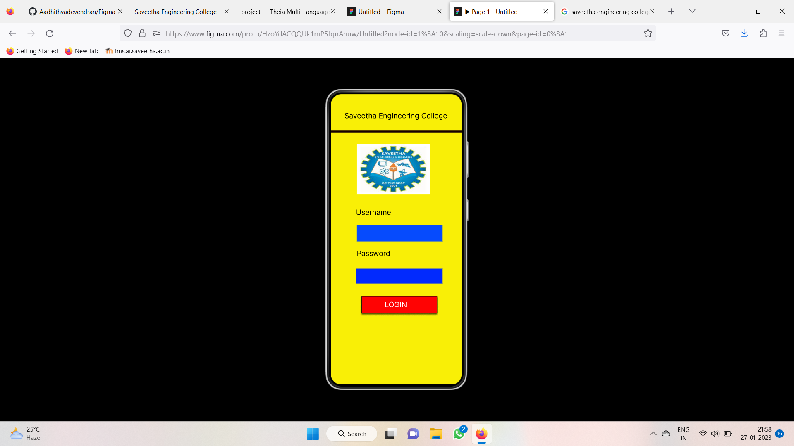
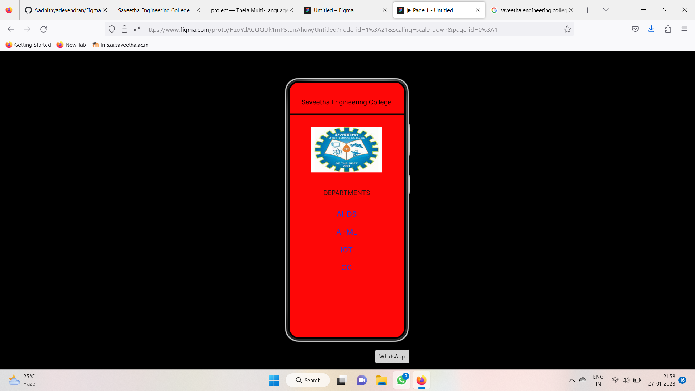

# Event Registration Web Application

## AIM:
To design, develop and deploy a web application for event registration.

## DESIGN STEPS:

### Step 1:
Create a new frame.

### Step 2:
Select any one preset size of your choice.

### Step 3:
Select the shapes you need.

### Step 4:
Import images as needed.

### Step 5:
Create pages based on your need and link them.

### Step 6:

Validate the HTML and CSS code.

### Step 6:

Publish the website in the given URL.

## DESIGN TOOL:
Figma
## code:

```
/* Home Page */

position: relative;
width: 360px;
height: 800px;

background: #2C88F2;

/* Saveetha Engineering College */

position: absolute;
width: 305px;
height: 32px;
left: 19px;
top: 49px;

font-family: 'Inter';
font-style: normal;
font-weight: 400;
font-size: 20px;
line-height: 24px;
text-align: center;

color: #FFFFFF;

/* Line 1 */

position: absolute;
width: 360.01px;
height: 0px;
left: 1px;
top: 107px;

border: 4px solid #181616;
transform: rotate(0.48deg);

/* logo 1 */

position: absolute;
width: 183px;
height: 136px;
left: 89px;
top: 138px;

background: url(logo.jpg);

position: absolute;
width: 212px;
height: 50px;
left: 75px;
top: 509px;

background: #FE0B0B;
box-shadow: 0px 4px 4px rgba(0, 0, 0, 0.25), 0px 4px 4px rgba(0, 0, 0, 0.25), 0px 4px 4px rgba(0, 0, 0, 0.25), 0px 4px 4px rgba(0, 0, 0, 0.25), 0px 4px 4px rgba(0, 0, 0, 0.25);

/* LOGIN */

position: absolute;
width: 212px;
height: 12px;
left: 74px;
top: 522px;

font-family: 'Inter';
font-style: normal;
font-weight: 400;
font-size: 20px;
line-height: 24px;
text-align: center;

color: #FFFFFF;

/* Affilated to Anna university NIRF Ranked Autonomous Instituition */

position: absolute;
width: 256px;
height: 120px;

font-family: 'Inter';
font-style: normal;
font-weight: 400;
font-size: 20px;
line-height: 24px;
text-align: center;

color: #000000;

/* Saveetha Engineering College */

position: absolute;
width: 283px;
height: 24px;
left: 38px;
top: 48px;

font-family: 'Inter';
font-style: normal;
font-weight: 400;
font-size: 20px;
line-height: 24px;
text-align: center;

color: #000000;

/* Line 2 */

position: absolute;
width: 360px;
height: 0px;
left: 0px;
top: 106px;

border: 5px solid #170101;

/* logo 2 */

position: absolute;
width: 201px;
height: 138px;
left: 72px;
top: 138px;

background: url(logo.jpg);
/* Rectangle 2 */

position: absolute;
width: 236px;
height: 44px;
left: 72px;
top: 362px;

background: #064BFD;

/* Rectangle 3 */

position: absolute;
width: 238px;
height: 41px;
left: 70px;
top: 481px;

background: #022AFD;

/* Username */

position: absolute;
width: 159px;
height: 10px;
left: 70px;
top: 314px;

font-family: 'Inter';
font-style: normal;
font-weight: 400;
font-size: 20px;
line-height: 24px;

color: #000000;

/* Password */

position: absolute;
width: 128px;
height: 19px;
left: 72px;
top: 427px;

font-family: 'Inter';
font-style: normal;
font-weight: 400;
font-size: 20px;
line-height: 24px;

color: #000000;

/* SEC page */

position: relative;
width: 360px;
height: 800px;

background: #FE0707;

/* AI-DS AI-ML 
IOT CC */

position: absolute;
width: 66px;
height: 196px;
left: 147px;
top: 400px;

font-family: 'Inter';
font-style: normal;
font-weight: 400;
font-size: 23px;
line-height: 28px;
text-align: center;

color: #0C3FF5;

mix-blend-mode: normal;

/* DEPARTMENTS */

position: absolute;
width: 148px;
height: 28px;
left: 106px;
top: 335px;

font-family: 'Inter';
font-style: normal;
font-weight: 400;
font-size: 20px;
line-height: 24px;
text-align: center;

color: #191515;
```

## OUTPUT:




## RESULT:
The program to design, develop and deploy a web application for event registration is completed successfully.